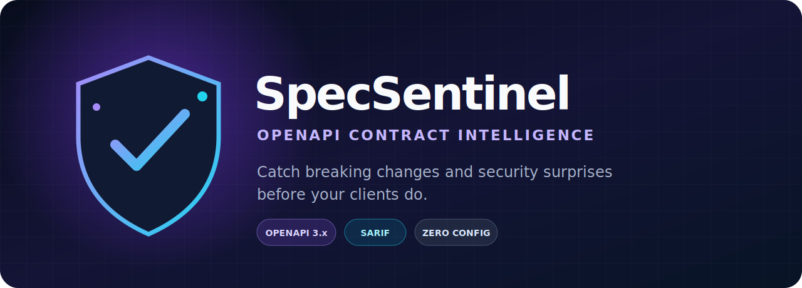

<p align="center">
  
</p>

<p align="center">
  <strong>Security-aware OpenAPI breaking-change detection that humans can read and CI can enforce.</strong>
</p>

<p align="center">
  <a href="https://github.com/mockingbird777/specsentinel/actions/workflows/ci.yml"></a>
  <a href="LICENSE"></a>
  
  
</p>

SpecSentinel compares two OpenAPI 3.x documents and flags common client-contract incompatibilities. It understands operations, parameters, recursive request and response schemas, local `$ref` components, and OpenAPI security alternatives. Reports can be read in a terminal, posted to a pull request, uploaded to GitHub Code Scanning, or shared as a self-contained HTML file.

<p align="center"><a href="https://mockingbird777.github.io/specsentinel/"><strong>Explore a live contract-diff report →</strong></a></p>

## Why SpecSentinel

- **Useful signal, not text noise.** It compares API semantics instead of diffing YAML lines.
- **Security-aware.** It flags newly required credentials, removed auth alternatives, and added OAuth scopes.
- **CI-native.** Severity thresholds, stable rule IDs, scoped suppressions, SARIF, and deterministic exit codes are built in.
- **Portable.** JSON and YAML input, five report formats, Node.js 20+, and one small runtime dependency.
- **Embeddable.** Use the CLI or import the typed diff engine in a governance tool.

## Quick start

```bash
npx --yes github:mockingbird777/specsentinel openapi.before.yaml openapi.yaml
```

The package is not published to the npm registry yet. To install the current GitHub source in a project:

```bash
npm install --save-dev github:mockingbird777/specsentinel#main
npx specsentinel diff api/baseline.yaml api/openapi.yaml --fail-on high
```

Example output:

```text
SpecSentinel 0.1.0
Comparing api/baseline.yaml → api/openapi.yaml

[HIGH] PARAM_REQUIRED_ADDED #/paths/~1pets/get/parameters/query/cursor
  Required query parameter 'cursor' was added.
[HIGH] SECURITY_STRENGTHENED #/paths/~1pets/get/security
  Security requirements became stricter for previously valid requests.

2 incompatible changes (2 high)
```

Try the included realistic fixture:

```bash
npm install
npm run build
node dist/cli.js fixtures/baseline.yaml fixtures/candidate.yaml --format markdown
```

## Rule matrix

| Rule ID | Default | What it catches |
| --- | --- | --- |
| `PATH_REMOVED` | critical | A baseline path disappeared |
| `OPERATION_REMOVED` | critical | A GET, POST, PUT, PATCH, DELETE, HEAD, OPTIONS, or TRACE operation disappeared |
| `PARAM_REQUIRED_ADDED` | high | A required parameter was added or an existing parameter became required |
| `PARAM_TYPE_CHANGED` | high | An existing parameter changed type |
| `PARAM_ENUM_NARROWED` | high | Accepted parameter values were removed or an unrestricted parameter gained an enum |
| `REQUEST_BODY_REQUIRED` | high | A request body became mandatory |
| `REQUEST_CONTENT_REMOVED` | high | An accepted request media type disappeared |
| `REQUEST_PROPERTY_REQUIRED` | high | A request property became mandatory, including through local `$ref` schemas |
| `REQUEST_TYPE_CHANGED` | high | A request schema type changed recursively |
| `RESPONSE_REMOVED` | high | A documented status response disappeared |
| `RESPONSE_CONTENT_REMOVED` | high | A response media type or schema disappeared |
| `RESPONSE_PROPERTY_REMOVED` | high | A response property disappeared recursively |
| `RESPONSE_TYPE_CHANGED` | high | A response schema type changed recursively |
| `SECURITY_STRENGTHENED` | high | Anonymous access/auth alternatives were removed, schemes were added, or OAuth scopes became stricter |

Every finding contains `ruleId`, `severity`, an RFC 6901-style OpenAPI location, a plain-English message, and structured `before` / `after` values where applicable.

## Reports

```bash
# Human-friendly terminal (default)
specsentinel old.yaml new.yaml

# Stable automation payload
specsentinel old.yaml new.yaml --format json --output report.json

# Pull-request summary
specsentinel old.yaml new.yaml --format markdown --output report.md

# GitHub Code Scanning / security tooling
specsentinel old.yaml new.yaml --format sarif --output report.sarif

# Portable, styled report with no server or assets
specsentinel old.yaml new.yaml --format html --output report.html
```

## Configuration and intentional changes

Pass a YAML or JSON config with `--config`. Suppressions should be narrow, reviewed, and temporary where possible.

```yaml
failOn: high
format: terminal

# Whole-rule suppression
ignoreRules:
  - RESPONSE_REMOVED

# Location-scoped suppression; `*` is a wildcard
ignores:
  - rule: RESPONSE_PROPERTY_REMOVED
    location: '#/paths/~1internal/*'
```

Command-line suppressions are useful for one-off investigations:

```bash
specsentinel old.yaml new.yaml --ignore RESPONSE_REMOVED --ignore SECURITY_STRENGTHENED
```

## GitHub Actions

The repository ships a Node 20 action whose dependency is bundled into `dist/action.cjs`:

```yaml
name: API compatibility
on: [pull_request]

jobs:
  contract:
    runs-on: ubuntu-latest
    permissions:
      contents: read
    steps:
      - uses: actions/checkout@v4
        with:
          fetch-depth: 0
      - name: Materialize baseline from the target branch
        run: git show "origin/${{ github.base_ref }}:api/openapi.yaml" > /tmp/openapi.baseline.yaml
      - name: Guard the contract
        uses: mockingbird777/specsentinel@v0.1.0
        with:
          baseline: /tmp/openapi.baseline.yaml
          candidate: api/openapi.yaml
          fail-on: high
          format: terminal
```

For Code Scanning, use the CLI to create SARIF and upload it even when findings are present:

```yaml
- uses: actions/setup-node@v4
  with: { node-version: 20 }
- name: Create SARIF
  continue-on-error: true
  run: npx --yes github:mockingbird777/specsentinel old.yaml new.yaml --format sarif --output specsentinel.sarif
- uses: github/codeql-action/upload-sarif@v3
  with: { sarif_file: specsentinel.sarif }
```

## Exit codes

| Code | Meaning |
| --- | --- |
| `0` | No unsuppressed finding meets `--fail-on` |
| `1` | At least one finding meets the severity threshold |
| `2` | Invalid CLI usage, unreadable input, malformed config, unsupported external `$ref`, or invalid OpenAPI document |

The default threshold is `high`. Choose from `info`, `low`, `medium`, `high`, or `critical`.

## Library API

```ts
import { diffOpenApi, parseOpenApi } from 'specsentinel';

const baseline = parseOpenApi(baselineSource, 'baseline.yaml');
const candidate = parseOpenApi(candidateSource, 'candidate.yaml');
const result = diffOpenApi({ baseline, candidate });

for (const change of result.changes) {
  console.log(change.ruleId, change.location, change.message);
}
```

## Supported references

SpecSentinel resolves internal JSON Pointer references such as `#/components/schemas/Pet` and preserves OpenAPI 3.1 `$ref` siblings. External file and URL references intentionally fail with exit code 2 instead of silently producing an incomplete analysis.

## Roadmap

- External multi-file and URL reference graphs with an explicit trust policy
- Discriminator, composition (`allOf` / `oneOf` / `anyOf`), numeric-bound, and nullable compatibility rules
- Baseline acquisition from Git tags and registries
- Inline suppression metadata with expiry dates and ownership
- Policy packs and custom rule plug-ins

## Project metadata

Suggested GitHub description: **Catch OpenAPI breaking changes and security regressions before they ship.**

Suggested topics: `openapi`, `api-governance`, `contract-testing`, `breaking-changes`, `devsecops`, `sarif`, `github-actions`, `typescript`. Machine-readable values live in [`REPO_META.json`](REPO_META.json).

## Contributing and security

Bug reports, rules, and focused compatibility fixtures are welcome. Read [CONTRIBUTING.md](CONTRIBUTING.md), the [Code of Conduct](CODE_OF_CONDUCT.md), and [SECURITY.md](SECURITY.md) before opening a contribution.

Released under the [MIT License](LICENSE).
